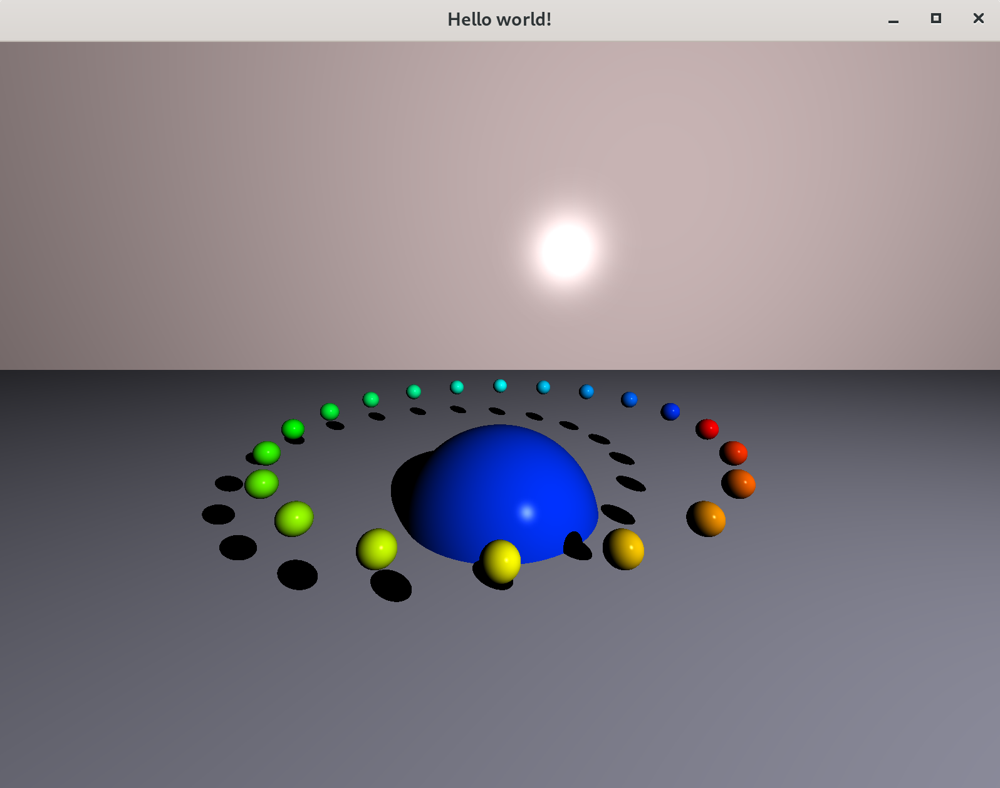

# 🔮 miniRT - Ray Tracing Engine

> "Simulating the physics of light, one pixel at a time."

[](https://en.wikipedia.org/wiki/C_(programming_language))
[](https://github.com/42Paris/minilibx-linux)
[](https://en.wikipedia.org/wiki/Linear_algebra)


*(Renderizado de prueba "Rainbow Ring" generado con el motor)*

## 🔦 Introducción

**miniRT** es un motor de renderizado basado en la física (Ray Tracing) escrito desde cero en C. A diferencia de la rasterización tradicional, este proyecto simula el comportamiento real de los rayos de luz: se lanzan rayos desde la cámara, se calculan intersecciones con objetos geométricos y se determina el color del píxel basándose en la iluminación y las sombras.

El objetivo es demostrar un dominio sólido del **álgebra lineal** (vectores, matrices, producto escalar) y la **optimización de código** sin depender de motores gráficos externos.

---

## 🖼️ Galería y Capacidades Físicas

### La "Cornell Box" (Test de Iluminación)
Esta escena clásica demuestra la capacidad del motor para manejar múltiples geometrías (planos, esferas, cilindros) y calcular sombras arrojadas ("Hard Shadows") con precisión desde una fuente de luz puntual.


### Características Técnicas
* **Primitivas Geométricas:**
    * **Esferas:** Intersección analítica (ecuación cuadrática).
    * **Planos:** Intersección vectorial infinita.
    * **Cilindros:** Superficie curva finita con tapas (el cálculo más complejo del proyecto).
* **Iluminación (Modelo Phong Simplificado):**
    * **Luz Ambiente:** Iluminación base constante.
    * **Luz Difusa:** Calculada según el ángulo de incidencia entre el rayo de luz y la normal de la superficie (`N · L`).
* **Cámara:** Posicionamiento y orientación completos en espacio 3D con FOV variable.

---

## 🛠️ Instalación y Uso

El proyecto requiere un entorno Unix (Linux/Mac) y la librería gráfica MinilibX (incluida o instalada en el sistema).

```bash
# 1. Clona el repositorio
git clone [https://github.com/grabier/miniRT.git]

# 2. Compila el ejecutable
cd miniRT && make

# 3. Ejecuta una escena
./miniRT scenes/scene_7.rt
